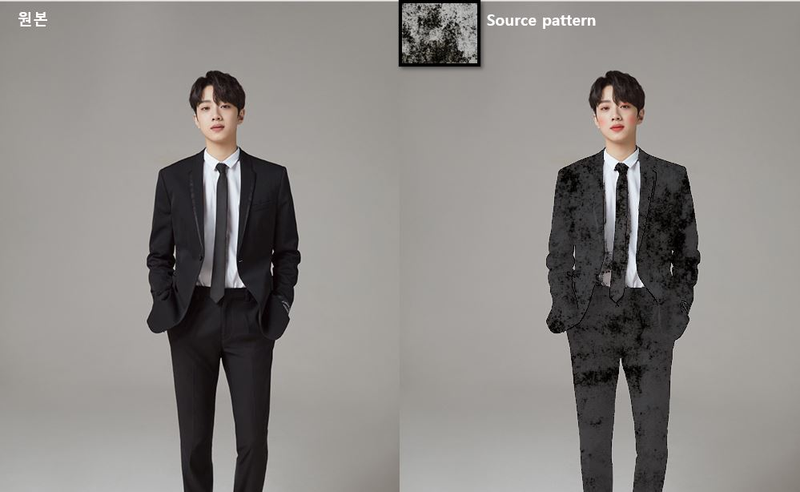
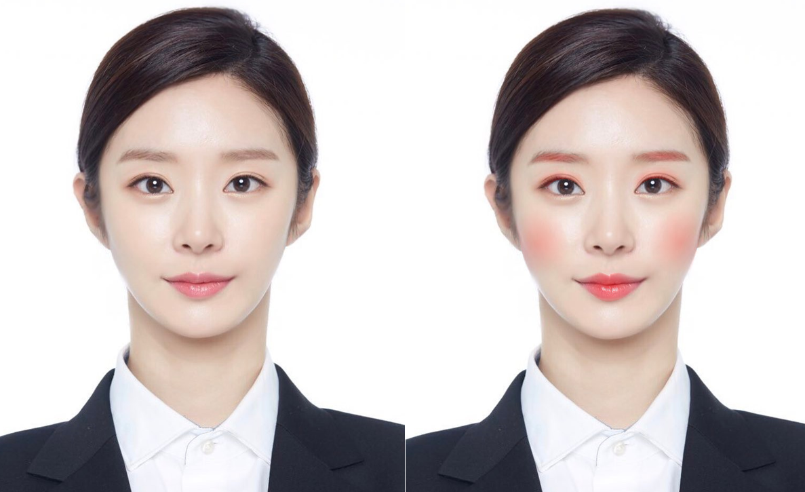
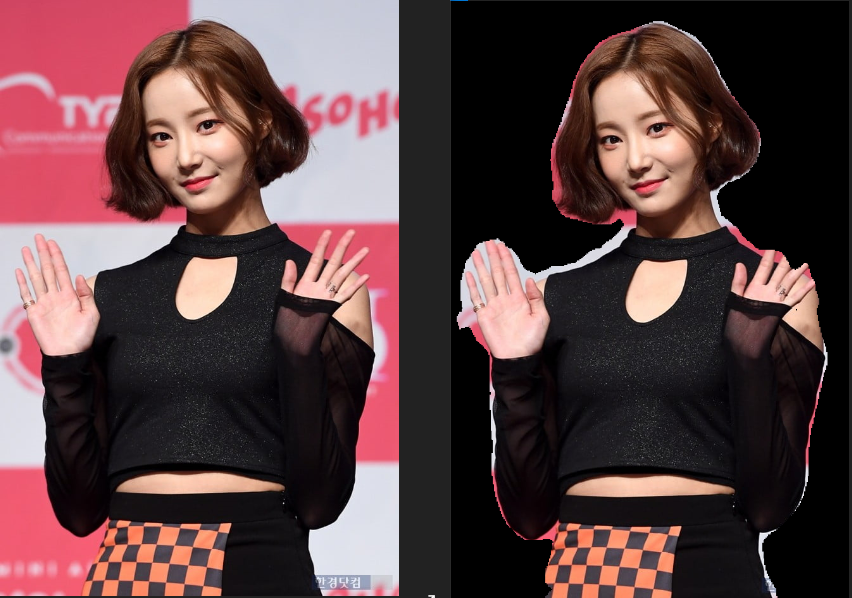
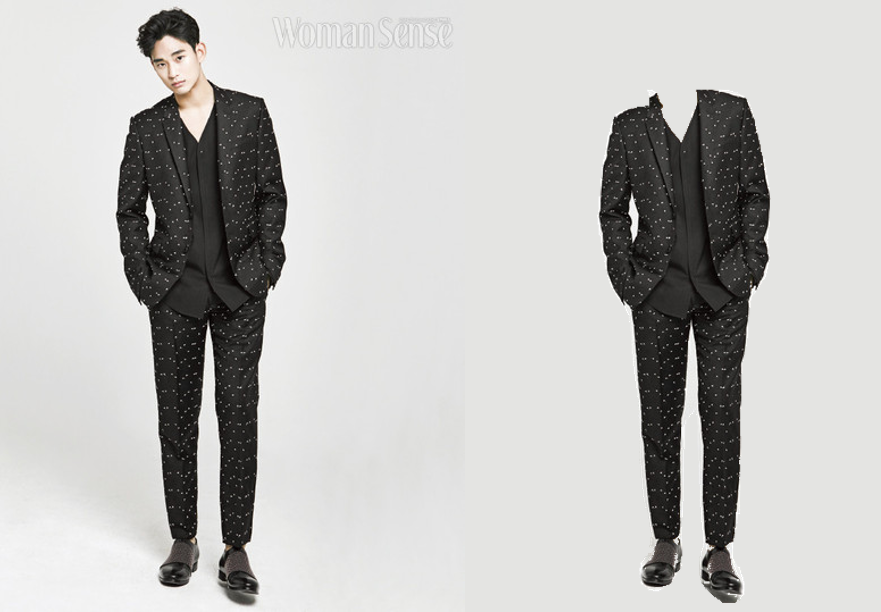
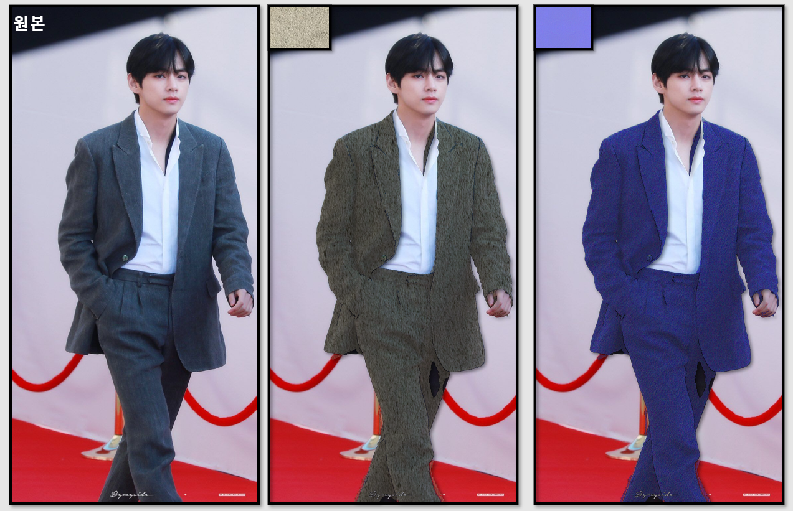
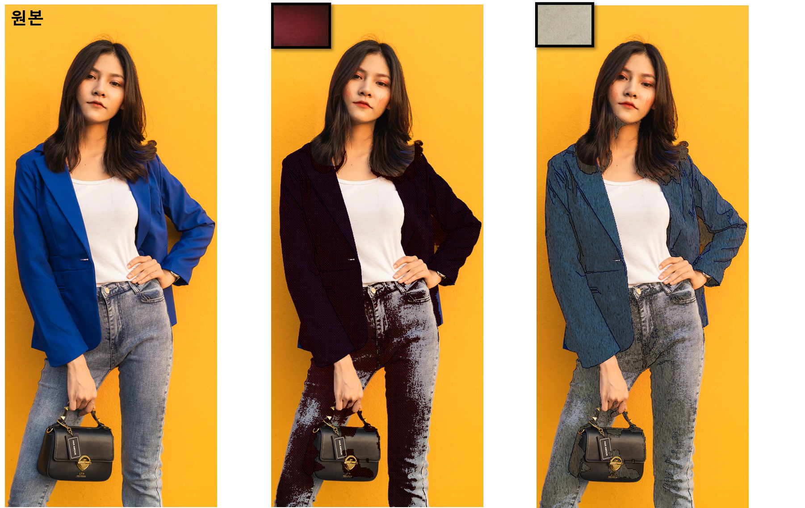

# MakeUpProject

## Description
- 실사 사진 바탕 화장 및 Clothes Swap 프로젝트

- 실행 결과


## Env
- Python 3.6
- Open CV 4.3.0
- Tensorflow 2.2.0
- numpy 1.17.4
- Illustration : CartoonGAN
- dlib 19.20.0
- matplotlib 3.2.2
- Pillow 7.2.0


## Progress
- [X] Face LandMark 부위별 추출 완료 [20.07.13]
- [X] Face Layer, Cheek Layer, eyebrow Layer추출 구현[20.07.21]
- [X] 섀도우, 눈 레이어 추가, 눈썹 레이어 수정[20.07.21]
- [X] CartoonGAN 적용, 실사 사진 일러스트화적용 [20.07.23]
- [X] CartoonGAN , Layer Extraction 모듈 통합 [20.07.27]
- [X] Clothes Layer Extraction구현 [20.08.03]
- [X] 배경분리 모듈 적용(Preprocessing) [20.08.03]
- [X] 각 레이어마다 알파값 적용(natural Make up)[20.08.04]
- [X] OpenCV활용, Clothes Texture 변경 적용 [20.08.05]
- [X] Convert 2D Pattern to 3D style [20.08.05]
- [X] Clothes Layer Extraction 정확도 개선 작업 [20.08.06]
- [X] Hair Segmentation 구현(딥러닝 모델 사용) [20.08.06]
- [X] Source Pattern별 각 clothes layer 출력 구현[20.08.10]
- [X] Eyeline layer 구현[20.08.12]

#### MakeUp Result 전/후



#### BackGround Removal 
  

#### FaceLayer Extraction
  

#### Cheek Layer Extraction
  

#### EyeBrow Layer Extraction
  

#### EyeShadow Layer Extraction


#### Clothes Layer Extraction
  
  
  
#### Clothes Texture Fitting

  

  

#### CartoonGAN processing 전/후
  

## Revision History
- Initialize Project [20.07.11]
- Modified : Face Part LandMark Extraction  [20.07.13]
- Added : Face Layer Extraction Module [20.07.20]
- Added : Eyebrow, Cheek Layer Extraction Module [20.07.21]
- Modified : Shadow and Eye Layer, Modification Eyebrow Layer [20.07.22]
- Added : CartoonGAN Module [20.07.23]
- Integrated : CartoonGAN & Face Layer Extraction Module [20.07.27]
- Added : Clothes Layer Extraction [20.07.27]
- Modified : Face Skin, Lip Layer Extraction Accuracy Improvement [20.07.31]
- Modified : Eye shadow layer can be extracted from the whole body picture [20.07.31]
- Added : Background Removal Module [20.08.03]
- Added : Clothes Layer Extraction [20.08.03]
- Added : Apply alpha value for each layer [20.08.04]
- Added : Clothes Texture Swap Module [20.08.05]
- Modified : Pattern List Applied [20.08.10]
## Lisence
MIT License

Copyright (c) [2020] [LeeJaeBeen]

Permission is hereby granted, free of charge, to any person obtaining a copy
of this software and associated documentation files (the "Software"), to deal
in the Software without restriction, including without limitation the rights
to use, copy, modify, merge, publish, distribute, sublicense, and/or sell
copies of the Software, and to permit persons to whom the Software is
furnished to do so, subject to the following conditions:

The above copyright notice and this permission notice shall be included in all
copies or substantial portions of the Software.

THE SOFTWARE IS PROVIDED "AS IS", WITHOUT WARRANTY OF ANY KIND, EXPRESS OR
IMPLIED, INCLUDING BUT NOT LIMITED TO THE WARRANTIES OF MERCHANTABILITY,
FITNESS FOR A PARTICULAR PURPOSE AND NONINFRINGEMENT. IN NO EVENT SHALL THE
AUTHORS OR COPYRIGHT HOLDERS BE LIABLE FOR ANY CLAIM, DAMAGES OR OTHER
LIABILITY, WHETHER IN AN ACTION OF CONTRACT, TORT OR OTHERWISE, ARISING FROM,
OUT OF OR IN CONNECTION WITH THE SOFTWARE OR THE USE OR OTHER DEALINGS IN THE
SOFTWARE.

## REF

```
- Background Removal Model Ref

https://github.com/susheelsk/image-background-removal

- Hair Segmentation Model Ref

https://github.com/Papich23691/Hair-Detection
```
