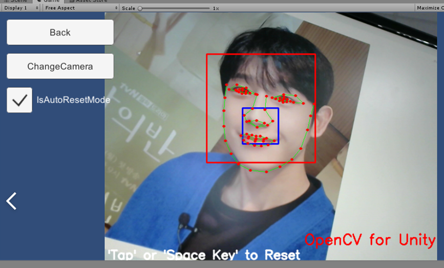
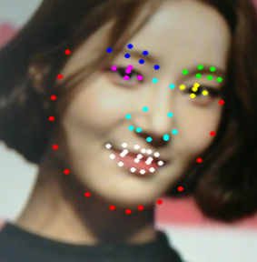

# MakeUpProject
실시간 얼굴 화장 및 화장품 추천 어플리케이션 개발 [Unity PlatForm]

## Description
- 실시간 얼굴 화장지원, 맞춤 컨설팅 및 제품 추천 어플리케이션
### Function
```
- 실시간 Face Make Up. 사용자가 마음에 드는 화장을 고를 시, 해당 화장에 맞는 제품 추천
- Personal Color Consulting
- AR 기능으로 여러가지 필터 지원
```
## Structure
- Based On Unity Project
- Open CV 
- Tensorflow Sharp

## Install

## Build
- Android
- IoS
## Lisence

## Progress
- Unity 상에서의 FaceRecognition 구현, Face Part별 화장 기능 구현 예정 [20.07.10]
- Face LandMark 부위별 추출 완료 [20.07.13]
- 시장성 문제로 인한 프로젝트 잠정 중단[20.07.14]



## Revision History
- Initialize Project [20.07.11]
- Modified : Face Part LandMark Extraction  [20.07.13]