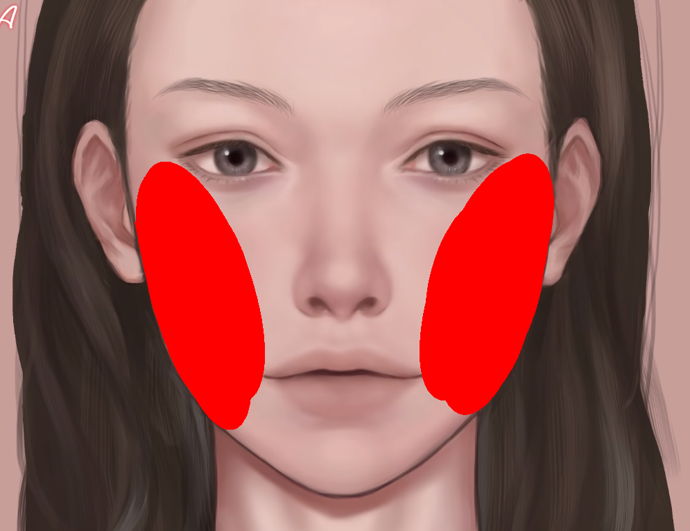
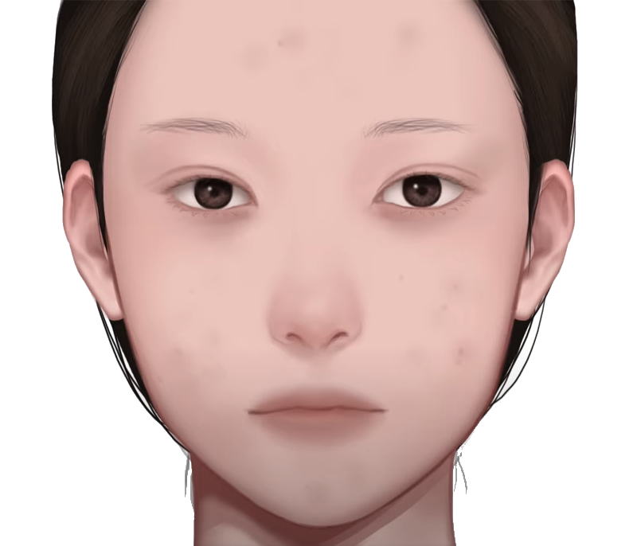
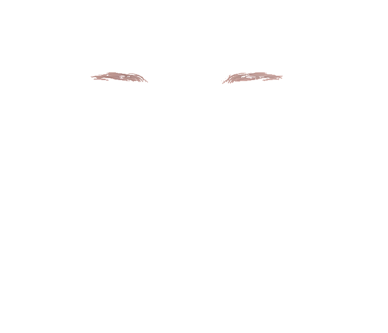

# MakeUpProject
게임 리소스[아바타 및 가상 인물] 생성 AI 프로젝트

## Description
- 게임 리소스 생성을 위한 AI기반 가상 얼굴 생성 및 Face Part Layer 추출

## Structure
- Based On Unity Project
- Open CV 
- dlib, Pillow
- Python3.6

## Progress
- [X] Unity 상에서의 FaceRecognition 구현, Face Part별 화장 기능 구현 예정 [20.07.10]
- [X] Face LandMark 부위별 추출 완료 [20.07.13]
- [X] 프로젝트 내용 변경 : 게임 리소스 활용을 위한 Face Layer 추출 및 Face Part Layer 추출[20.07.20]
- [X] Face Layer, Cheek Layer, eyebrow Layer추출 구현[20.07.21]
- [X] 섀도우, 눈 레이어 추가, 눈썹 레이어 수정[20.07.21]
- [X] CartoonGAN 적용, 실사 사진 일러스트화적용 [20.07.23]
- [ ] Clothes Layer Extraction
- [ ] Body Layer Extraction
- [ ] Convert 2D Pattern to 3D style
#### CartoonGAN processing 전/후
  

#### FaceLayer Extraction
  

#### Cheek Layer Extraction
  

#### Eyebrow Layer Extraction
  

## Revision History
- Initialize Project [20.07.11]
- Modified : Face Part LandMark Extraction  [20.07.13]
- Added : Face Layer Extraction Module [20.07.20]
- Added : Eyebrow, Cheek Layer Extraction Module [20.07.21]
- Modified : Shadow and Eye Layer, Modification Eyebrow Layer [20.07.22]
- Added : CartoonGAN Module [20.07.23]

## Lisence
MIT License

Copyright (c) [2020] [LeeJaeBeen]

Permission is hereby granted, free of charge, to any person obtaining a copy
of this software and associated documentation files (the "Software"), to deal
in the Software without restriction, including without limitation the rights
to use, copy, modify, merge, publish, distribute, sublicense, and/or sell
copies of the Software, and to permit persons to whom the Software is
furnished to do so, subject to the following conditions:

The above copyright notice and this permission notice shall be included in all
copies or substantial portions of the Software.

THE SOFTWARE IS PROVIDED "AS IS", WITHOUT WARRANTY OF ANY KIND, EXPRESS OR
IMPLIED, INCLUDING BUT NOT LIMITED TO THE WARRANTIES OF MERCHANTABILITY,
FITNESS FOR A PARTICULAR PURPOSE AND NONINFRINGEMENT. IN NO EVENT SHALL THE
AUTHORS OR COPYRIGHT HOLDERS BE LIABLE FOR ANY CLAIM, DAMAGES OR OTHER
LIABILITY, WHETHER IN AN ACTION OF CONTRACT, TORT OR OTHERWISE, ARISING FROM,
OUT OF OR IN CONNECTION WITH THE SOFTWARE OR THE USE OR OTHER DEALINGS IN THE
SOFTWARE.