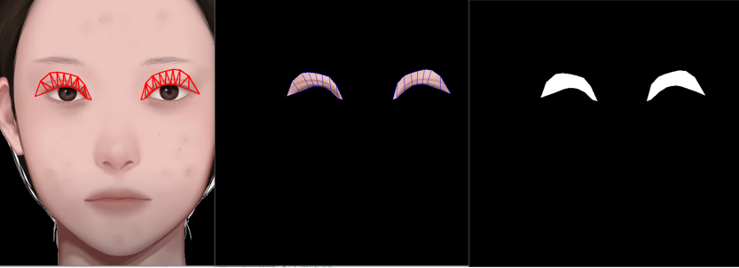
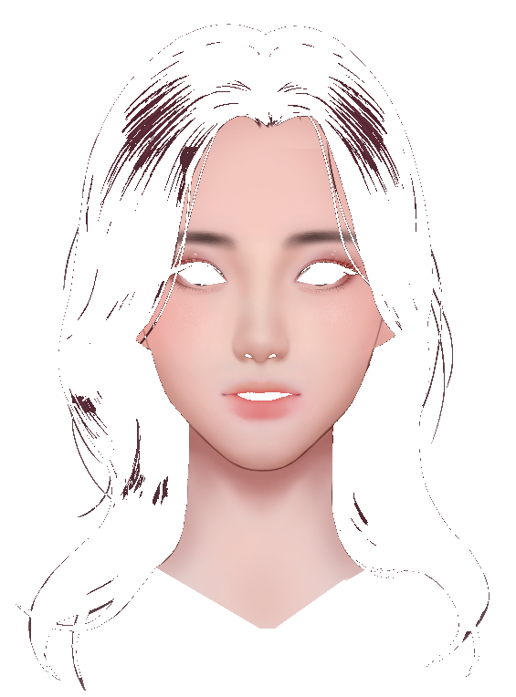
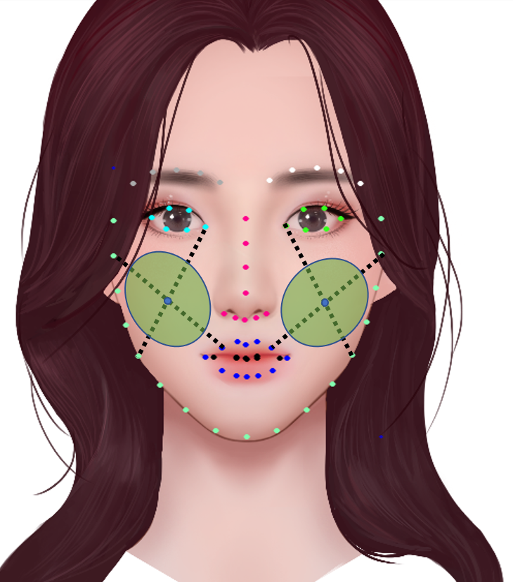

# MakeUpProject
게임 리소스[아바타 및 가상 인물] 생성 AI 프로젝트

## Description
- 게임 리소스 생성을 위한 AI기반 가상 얼굴 생성 및 Face Layer 추출
### Function
```
- 실시간 Face Make Up. 사용자가 마음에 드는 화장을 고를 시, 해당 화장에 맞는 제품 추천
- Personal Color Consulting
- AR 기능으로 여러가지 필터 지원
```
## Structure
- Based On Unity Project
- Open CV 
- Tensorflow Sharp

## Install

## Build
- Android
- IoS
## Lisence

## Progress
- Unity 상에서의 FaceRecognition 구현, Face Part별 화장 기능 구현 예정 [20.07.10]
- Face LandMark 부위별 추출 완료 [20.07.13]
- 시장성 문제로 인한 프로젝트 잠정 중단[20.07.14]
- 프로젝트 내용 변경 : AI 기반 가상 얼굴 생성, 게임 리소스 활용을 위한 가상얼굴 추출 및 Face Layer[mouse nose eyebrow eye ...]를 추출[20.07.20]
- Face Layer, Cheek Layer추출 구현[20.07.21]

  

  
   

## Revision History
- Initialize Project [20.07.11]
- Modified : Face Part LandMark Extraction  [20.07.13]
- Modified : Face Layer Extraction Module [20.07.20]